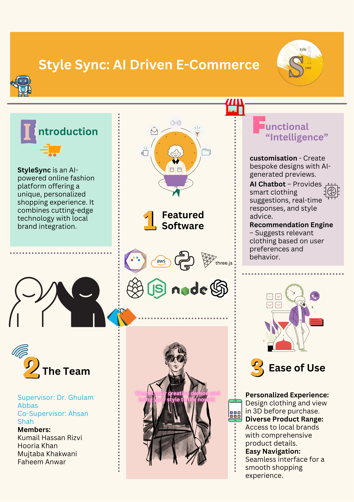
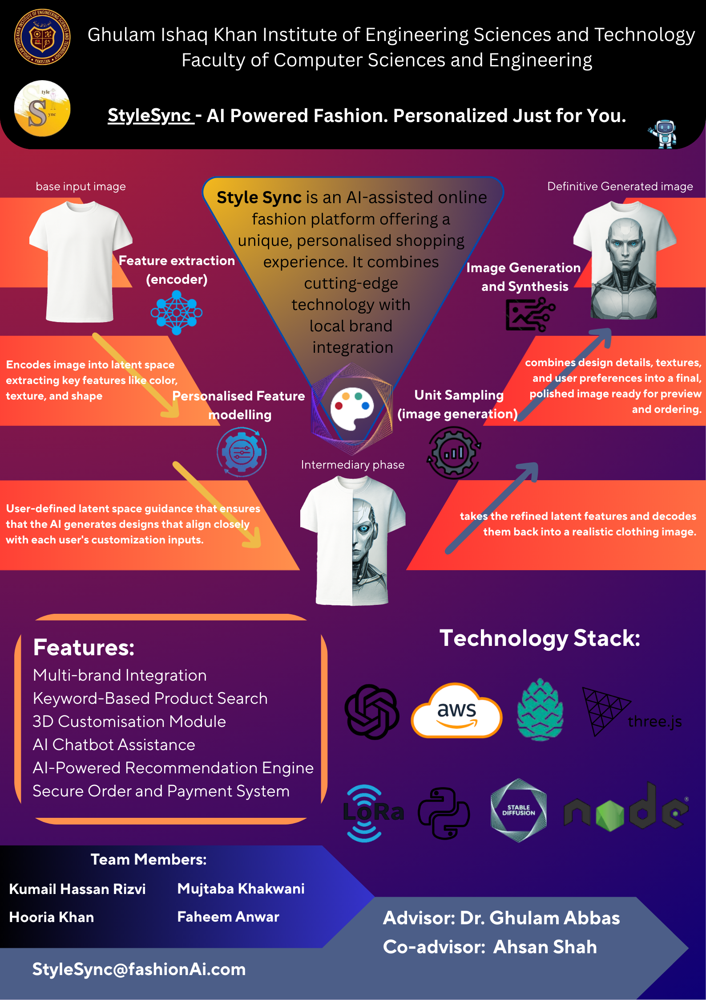

# Style-Sync---AI-Driven-Fashion
AI-Driven E-Commerce &amp; Customisation Platform. GIK Institute Final Year Project Showcase.

> **Note on Proprietary Status:** This project is currently being developed as a startup concept. While the source code is private, this repository serves as a technical showcase of the architecture, branding, and core AI methodology.

StyleSync is a cutting-edge fashion platform that merges Generative AI with e-commerce. It allows users to design, customize, and visualize clothing in 3D using Stable Diffusion and advanced neural architectures.

---

## 🎨 Project Showcase & Architecture
This project was recognized for excellence in technical branding and system design at **GIK Institute**.

### 🛠️ The Vision & Workflow
The system utilizes a custom AI pipeline to transform user prompts and base images into high-fidelity fashion renders.

  
  

> [!IMPORTANT]
> **Deep Dive into Architecture:** The section below contains the full technical methodology and GIKI-recognized board. Click to expand and see the Stable Diffusion & GAN-based pipeline.

  

 
  

   
  

    
  

---

## 🏗️ Technical Stack
- **Generative AI:** Stable Diffusion, LoRA, GANs
- **Frontend:** React.js, Three.js (3D Visualization), Tailwind CSS
- **Backend:** Node.js, Python (FastAPI for AI inference)
- **Cloud/Infrastructure:** AWS (S3, EC2), Docker
- **Database:** Pinecone (Vector DB for AI search), PostgreSQL

---

## ✨ Key Features
- **AI Customization Module:** Generate bespoke clothing designs via latent space manipulation.
- **3D Visualization:** Real-time 3D previews of customized products using Three.js.
- **AI Chatbot Assistance:** Smart recommendations based on user style preferences.
- **Local Brand Integration:** A bridge between high-tech AI design and local manufacturing.

---

## 📬 Contact for Inquiries
As this project is under active development for commercial release, the full codebase is available for viewing to recruiters and potential partners upon request.

**Connect with me:** [LinkedIn](YOUR_LINKEDIN_URL) | [Email](mailto:StyleSync@fashionAi.com)
